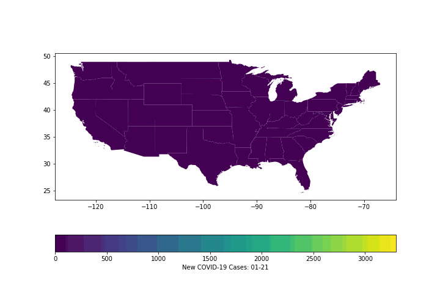

# Geographic-COVID-analysis
 Maps of New COVID-19 cases by state through time.
 
 COVID-19 data from https://github.com/nytimes/covid-19-data.
 
 Shapefile from https://www.census.gov/geographies/mapping-files/time-series/geo/carto-boundary-file.html
 
 Population data from https://en.wikipedia.org/wiki/List_of_states_and_territories_of_the_United_States_by_population
 
 Final product:
 ## New COVID-19 cases per state
 
 ## New COVID-19 cases per state smoothed
 
 ## New COVID-19 cases per capita per state
 
 ## New COVID-19 cases per capita per state smoothed
 
